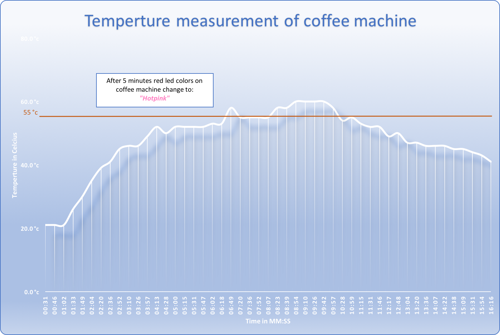

# Minor Web of Things - I'm Thirsty
## Live version
- http://wot-drinks.herokuapp.com/

## Concept
Serving drinks can be a pain. By using this web application, this no longer has to be the case. This app, will keep track of who and what everyone wants to drink.

### User description
This app is for everyone, that works in a large groups and has problems with keeping track of drink orders and hates to stay next to a coffee machine, to wait for the coffee to finish brewing.

## Scenarios
#### Scenario 1: I'm thirsty, but don't know what to drink.
If you are thirsty, you simply press the button on the top side your box. The box will send a request to the app and the app will do the rest. The app will get the best possible drink for the current time and temperature. If there are more people, that want to drink the same thing, they also press a button and they will be added to a list.

When everyone, that wants to, has chosen to join the drinking list, the app will randomly select a user, that has to get the drinks. Now you can see how many drinks it takes to serve everyone and can you decide, how much coffee you need to make.

 <strong>How it works</strong> 
- When a user wants to drink something, he or she presses a button, that sends a signal to a PHP server, that talks to a Express server. The Express server talks to a Weather API and it gets the current Temperature and Time.
  
- The Expres server looks at the Time and Temperature and choices, the best fitting drink for the current time and temperature. Then the server sends the drink type to a website, that keeps track of the drink type.
  
- The Express server sends a message to the PHP server and the PHP server changes the color of all the connected buttons, to a color that represents the selected drink type. If a different user also wants that drink she presses her button and she gets added to the list, with people that want to same drink.
  
- When you are finished with preparing the drinks, you can see who also wants that drink and serving the drinks will be easier.

#### Scenario 2: I want to know if the coffee is ready.
If you are thirsty and want to know if the coffee is ready, the user can go to the website and he/she can see the state of the coffee. By doing this, you know exactly when the coffee is ready and you only have to walk to the coffee machine, to get the coffee. This way, needlessly walk to the machine, to check if the coffee is ready, will be a thing of the past.

 <strong>How it works</strong> 
- Near the coffee machine is a box, with heat-sensor, that tracks if the coffee machine is setting coffee (every 15seconds). The box displays a color, that indicates if the coffee is ready or not (This color corresponds to the temperature of the machine).
  
- When the temperature of the coffee machine is 35 °C or more, the box will send the temperature directly to the Express server. The Express server will show a message on the website, that the coffee is ready.

## Flows
#### Data Flow

#### Code Flow

## Screens

## Coffee machine heat chart
During a test run of the coffee machine, we created a temperature chart. Every 15 seconds a measurement was done at the temperature and humidity above the Coffee machine. In the chart, you are able to see that it takes approximately six minutes to get to the maximum measurable temperature of the DHT11 module. Five minutes after hitting the maximum temperature you can see in the chart that the temperature goes down, this is because of the coffee machine is done making the coffee. When the coffee machine gets to a temperature of 55 degrees the node module will display the color "Hotpink" after five minutes.

## Features
- Make a list with all the people, that are online and want coffee.
- Select a random user, that needs to make coffee.
- Get the Weather of a external API
- Chose a special drink based on the date from the external Weather APi.
- Sensors to detect, when the drinks are ready (heat sensor).
- Box feedback, when receiving a message. (vibration and light signal).
- Turn messages off, when button is on it's side.

### Necessary
- [x] Node app Express server. (backend).
- [x] Webpage, to join the app  (frontend).
- [x] Boxes, that light up to show who is going to set the coffee (hardware).
- [x] Code for the boxes, to communicate with the server/webpage and other boxes.
- [x] Sensors to detect, when the drinks are ready (heat sensor).
- [x] Box feedback, when receiving a message. (vibration and light signal).
- [x] Frendly ui/ ux

### Usage
- Upload the correct code to your box.
- Give the box a power supply. (Battery, powerbank)
- Press the button, when you are thirsty.
- See who's box is vibrating and blinking.
- If it is your box, you need to get the drinks (see the color for what drink you need to get).
- If it is not your box, that lights up. You can just sit and wait for the coffee, to be brought to you.

### Colors
- #d0f0c0 <strong>Light green:</strong> When the outside temperture is less than or equal to -5 &#8451;, the system will chose the color light green, when a user selects, that he/she wants something to drink. This color shows, that the best possible drink for that temperture is a cup of <stong>tea</strong>.

- #a46331 <strong>Brown:</strong> If the outside temperture is between -4 &#8451; and 15 &#8451;, the system will chose the color brown, to show that the best drink is <strong>Coffee</strong> (and who doesn't like coffee?).</li>

- #ffff00 <strong>Yellow:</strong> When the outside temperture is more than 15 &#8451;, the system will chose the yellow, to show that the best possible solution for that kind of heat, is to have a nice cold <strong>Beer</strong>

(These colors a better visable on the led boxes)

### Tilt-switch
The tilt-switch detects the orientation of a led box. If the box stands up right, than the box will be on. When the box is laying flat, box will be on standby and won't receive of send any messages, while it is lanying on it's side.

### Vibration motor
The vibration motor sends vibrations, to your box when it received a new message. This is, so that the user does not only get a visual feedback (led-lights), but also a auditory feedback (vibrations).

## Wishlist
- [ ] Add a estimated time, when the coffee is ready. (Example: 2:31 minutes remaining).
- [ ] Replace the head sensor with a smart socket, to track the electricity usage, to track if the coffee is ready.
- [ ] Make a list with how often someone wanted to drink coffee.
- [ ] Make a ranking, that shows how often someone had to make coffee.
- [ ] Make it, so that the random user selection depends how often someone has already made coffee.

## Sources
- http://www.seeedstudio.com/forum/viewtopic.php?f=17&t=5636
- http://www.barcelona-metropolitan.com/downloads/23010/download/coffee-821490.jpg?cb=a38e161ac00e1e82858886d77f42cf1a
- https://www.sunfounder.com/media/wysiwyg/swatches/sensor_kit_v1_for_arduino/15_Tilt_Switch/15_1.jpg
- https://static.webshopapp.com/shops/069283/files/039224572/originele-vibratie-motor-voor-thl-telefoon.jpg?_ga=2.134731185.1158232172.1493797986-1812068030.1493797986
